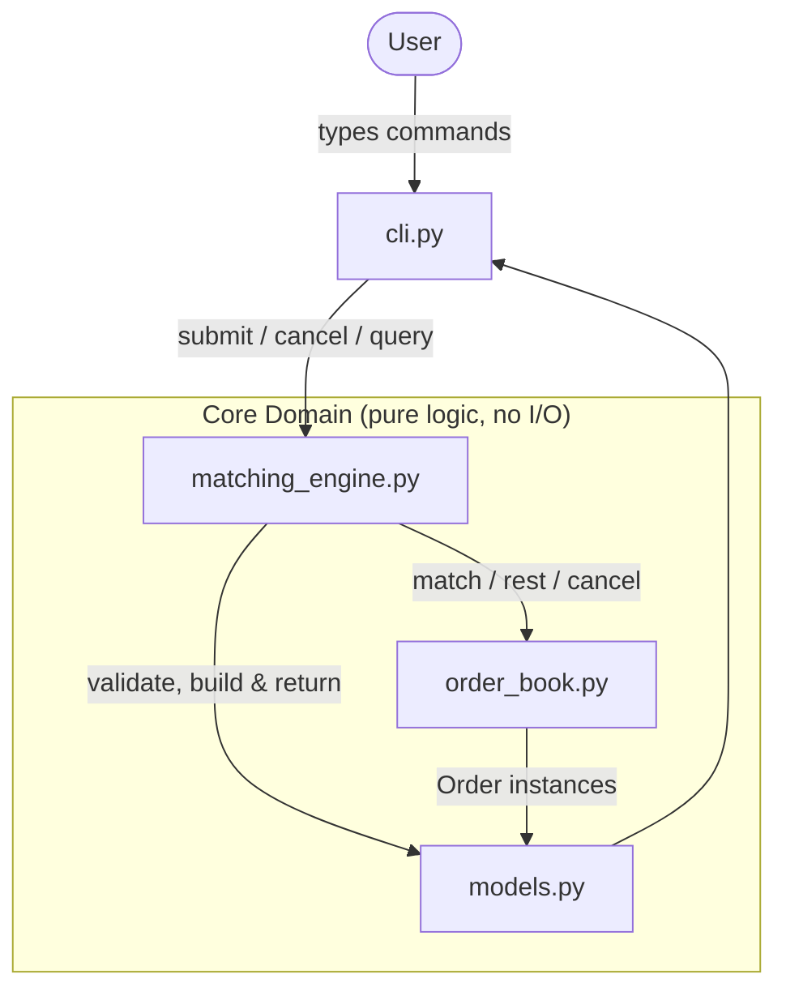

# Design Document: Limit Order Book & Matching Engine

## Overview

This document describes the technical design of a Python simulation of a simple electronic-exchange **limit order book** and **matching engine**. The system models a continuous double auction: incoming buy and sell orders are matched against resting orders on the opposite side of the book using **price-time priority**. It supports limit and market orders, cancellation by identifier, trade recording, and inspection of the top of book, all driven from a command-line interface.

The design optimizes for **clarity, correctness, and explainability** in a software-engineering interview setting — not for exhaustive exchange feature coverage or micro-optimized throughput. Dependencies are limited to the Python standard library.

### Approved Design Decisions

These decisions are fixed and are reflected throughout the design:

| Decision | Effect on design |
| --- | --- |
| Execution price = **resting order's limit price** | Trade price is always taken from the resting side, never the aggressor (Req 3.6). |
| Unfilled **market** quantity is **discarded** | Market orders never rest; only unfilled **limit** remainder rests (Req 2.6, 2.7). |
| Single instrument, no tick size, no self-trade prevention | No instrument routing, no price-grid validation, no owner concept. |
| Order IDs are monotonically increasing integers starting at **1** | A simple session counter; no UUIDs (Req 1.6). |
| Quantity is a **positive integer**; limit price is a **positive value** | Validation rejects `<= 0`; no artificial upper bound (Req 1.3, 1.5). |

### Explicitly Out of Scope

Web frontend, authentication, cloud infrastructure, AI features, multi-instrument support, tick-size rules, self-trade prevention, and any speculative abstraction beyond what the requirements demand.

### Key Technology Choices

- **Language / dependencies:** Python 3.10+, standard library only. `dataclasses`, `enum`, `collections.deque`, and `heapq` cover every need.
- **Price representation:** prices are stored as **`decimal.Decimal`**. Rationale below.
- **Test framework:** **pytest** (recommended). Rationale in the Testing Strategy section.

#### Why `Decimal` for prices

Binary floating point (`float`) cannot represent common decimal fractions like `0.1` exactly, so arithmetic and equality comparisons on monetary values become unreliable (e.g. `0.1 + 0.2 != 0.3`). Two safe options exist:

1. **Integer minor units ("cents")** — store `12345` to mean `123.45`. Fast and exact, but pushes a scaling convention onto every caller and every display path, and the requirements place *no fixed tick size or scale* on prices.
2. **`decimal.Decimal`** — exact decimal arithmetic, natural equality and ordering, and prices read/write as the user typed them.

Because price-time priority relies heavily on **exact price equality** (grouping orders into price levels) and **ordering** (best bid/ask), and because the requirements deliberately avoid a fixed scale, `Decimal` is the clearest, least error-prone choice for an interview-grade simulation. Quantities remain plain Python `int` since they are inherently whole units.

## Architecture

### Module Breakdown

The codebase is organized into small, single-responsibility modules. Each module maps directly to a concept in the requirements glossary.

| Module | Responsibility | Primary requirements |
| --- | --- | --- |
| `models.py` | `Side` and `OrderType` enums; the `Order` and `Trade` dataclasses; the result/response value types (`SubmissionResult`, `Fill`, `CancellationResult`, `TopOfBook`, `BookLevel`, `ValidationError`); and order-level validation helpers. | Req 1, 2, 4, 5, 6 |
| `order_book.py` | The `OrderBook`: resting orders organized by side and price level, best bid/ask retrieval, aggregate quantity, popleft-based removal of a filled best order, and lookup/removal by ID for cancellation. | Req 3, 4, 6 |
| `matching_engine.py` | The `MatchingEngine`: order ID assignment, validation orchestration, the matching algorithm, trade generation and the trade log, resting the unfilled limit remainder, cancellation, and top-of-book / trade-history queries. Returns result objects. | Req 1–6 |
| `cli.py` | The interactive read-eval-print loop: command parsing, argument validation, formatting engine results and errors for display, and session termination. | Req 7 |
| `tests/` | Deterministic pytest unit tests covering matching behavior. | Req 8 |

> Collapsing the small domain and result types into a single `models.py` keeps the layout flat: the enums, `Order`, `Trade`, and the result shapes are all lightweight value definitions that both the engine and the CLI depend on, so grouping them avoids a scatter of tiny modules and any circular-import risk while keeping the types cohesive.

### Component Diagram



The **core domain** (models, book, engine) is pure in-memory logic with no I/O. The **CLI** is the only module that reads stdin and writes stdout. This separation makes the engine directly unit-testable without touching the terminal (Req 8.9).

### Data Flow: Order Submission and Matching

```mermaid
sequenceDiagram
    participant U as User
    participant C as CLI
    participant E as MatchingEngine
    participant B as OrderBook
    participant T as TradeLog

    U->>C: submit limit buy 10 @ 100.5
    C->>C: parse & validate arguments
    C->>E: submit(side, type, qty, price)
    E->>E: validate fields (qty>0, price>0, side valid)
    alt invalid
        E-->>C: SubmissionResult(rejected, ValidationError)
        C-->>U: error message (no order id)
    else valid
        E->>E: assign next order_id
        loop while remaining>0 and price-eligible resting exists
            E->>B: peek best opposite resting order
            B-->>E: resting order
            E->>E: matched_qty = min(remaining, resting.remaining)
            E->>E: exec_price = resting.price
            E->>T: record Trade
            E->>B: reduce resting; if fully filled, pop_best_opposite (popleft)
        end
        alt limit order with remaining>0
            E->>B: rest remainder at limit price
        else market order with remaining>0
            E->>E: discard remaining
        end
        E-->>C: SubmissionResult(order_id, fills, discarded_qty)
        C-->>U: order id and/or trade lines + discarded note
    end
```

## Components and Interfaces

This section sketches the public surface of each module in Python-flavored pseudocode. Signatures are illustrative; the goal is to fix responsibilities and boundaries, not final implementation.

### `matching_engine.py` — the orchestrator

```python
class MatchingEngine:
    def __init__(self) -> None:
        self._book = OrderBook()
        self._trades = TradeLog()
        self._next_order_id = 1
        self._next_trade_id = 1

    def submit(self, side, order_type, quantity, price=None) -> SubmissionResult:
        """Validate, assign an id, match, then rest (limit) or discard (market)."""

    def cancel(self, order_id) -> CancellationResult:
        """Remove a resting order by id; report removed remaining quantity."""

    def top_of_book(self) -> TopOfBook:
        """Best bid/ask with aggregate quantity (nulls when a side is empty)."""

    def trade_history(self) -> list[Trade]:
        """All recorded trades in ascending occurrence order (may be empty)."""
```

### `order_book.py` — resting-order storage and priority

```python
class OrderBook:
    def add(self, order: Order) -> None: ...          # rest a limit remainder
    def best_bid_level(self) -> BookLevel | None: ...  # highest buy price + aggregate qty
    def best_ask_level(self) -> BookLevel | None: ...  # lowest sell price + aggregate qty
    def best_opposite(self, incoming_side: Side) -> Order | None:
        """Peek the highest-priority resting order on the side opposite the incoming order."""
    def pop_best_opposite(self, incoming_side: Side) -> Order | None:
        """Remove and return the front (best price, earliest arrival) resting order on the
        side opposite the incoming order via deque.popleft(); also delete it from by_id and,
        if its price level's deque becomes empty, drop the level (its heap entry is reaped
        lazily on the next best-price peek). O(1). Used for full-fill removal during matching."""
    def remove(self, order_id: int) -> Order | None:
        """Cancel path only: locate a resting order by id and remove it from its price-level
        deque (O(k) scan) and from by_id. NOT used for full-fill removal during matching."""
    def get(self, order_id: int) -> Order | None: ...
```

### `models.py`

`models.py` holds the data definitions (see Data Models) plus small pure helpers such as `validate_submission(...)`, which returns either a normalized set of fields or a `ValidationError`.

### `cli.py` — interactive loop

```python
def run(engine: MatchingEngine, input_fn=input, output_fn=print) -> None:
    """REPL: read a line, dispatch to a command handler, format the result."""
```

`input_fn` / `output_fn` are injected so the CLI can be exercised in tests without real stdin/stdout.

## Data Models

### Enums

```python
from enum import Enum

class Side(Enum):
    BUY = "Buy"
    SELL = "Sell"

class OrderType(Enum):
    LIMIT = "Limit"
    MARKET = "Market"
```

`Side.value` uses the exact `"Buy"` / `"Sell"` strings the requirements validate against (Req 1.4), so parsing user input maps cleanly onto the enum and rejects anything else.

### Order

```python
from dataclasses import dataclass
from decimal import Decimal

@dataclass
class Order:
    order_id: int                 # assigned by the engine, >= 1
    side: Side
    order_type: OrderType
    quantity: int                 # original submitted quantity, > 0
    remaining_quantity: int       # decremented as fills occur; starts == quantity
    price: Decimal | None = None  # required for LIMIT, must be None for MARKET
```

- `remaining_quantity` starts equal to `quantity` and is reduced on each fill (Req 3.7).
- `price` is `None` for market orders (Req 1.1/1.2 — market carries no limit price).
- No separate arrival counter is stored. Time priority within a price level is preserved structurally by the per-price-level `deque`: orders are appended on arrival and consumed from the front, so the earliest-arriving order matches first (Req 3.3). Order IDs are already monotonically increasing, so `order_id` can serve as an arrival tiebreaker if one is ever needed — making a dedicated `sequence` field redundant.

### Trade

```python
from datetime import datetime, timezone

@dataclass(frozen=True)
class Trade:
    trade_id: int                 # monotonically increasing, unique (Req 5.1)
    price: Decimal                # execution price = resting order's limit price (Req 3.6)
    quantity: int                 # matched quantity (Req 3.7)
    aggressor_order_id: int       # the incoming order (Req 5.1)
    resting_order_id: int         # the resting order that was matched
    aggressor_side: Side          # side of the incoming order (Req 5.1)
    timestamp: datetime           # moment of execution, UTC (Req 5.2)
```

`Trade` is `frozen` because a completed trade is an immutable historical fact; the log never mutates recorded trades (Req 4.5, 5.4).

### Result / Response Types (in `models.py`)

```python
@dataclass(frozen=True)
class Fill:
    """One execution produced during a single submission."""
    trade_id: int
    price: Decimal
    quantity: int
    resting_order_id: int

@dataclass(frozen=True)
class SubmissionResult:
    accepted: bool
    order_id: int | None                 # present when accepted
    fills: list[Fill]                    # empty when nothing matched
    resting_quantity: int                # limit remainder added to book (0 for market)
    discarded_quantity: int              # unfilled market qty discarded (0 for limit)
    error: "ValidationError | None" = None

@dataclass(frozen=True)
class CancellationResult:
    success: bool
    order_id: int | None
    removed_quantity: int | None         # remaining qty removed on success (Req 4.1/4.5)
    error: "ValidationError | None" = None

@dataclass(frozen=True)
class BookLevel:
    price: Decimal | None                # None when the side is empty (Req 6.3/6.4)
    aggregate_quantity: int              # 0 when the side is empty

@dataclass(frozen=True)
class TopOfBook:
    best_bid: BookLevel                  # price None / qty 0 when no bids
    best_ask: BookLevel                  # price None / qty 0 when no asks

@dataclass(frozen=True)
class ValidationError:
    code: str                            # e.g. "INVALID_QUANTITY", "ORDER_NOT_FOUND"
    message: str                         # human-readable reason for the CLI
```

Using explicit result objects (rather than raising for expected outcomes like "order not found" or "invalid quantity") keeps the engine's control flow linear and gives the CLI a single, uniform shape to format for every command (Req 7.1–7.3, 7.9, 7.10).


## Order Book Design

The order book holds all resting limit orders, organized so that the matching engine can repeatedly retrieve the highest-priority order on a given side, and so that the CLI can read the top of book cheaply.

### Structure per side

Each side (buy and sell) is stored as **two coordinated structures**:

1. **`levels: dict[Decimal, deque[Order]]`** — a map from price to a FIFO queue of orders resting at that price. The `deque` preserves **time priority**: orders are appended on arrival and consumed from the front, so the earliest-arriving order at a price matches first (Req 3.3). Aggregate quantity at a level is the sum of `remaining_quantity` over the deque (Req 6.5/6.6).

2. **A sorted price index** that yields the **best** price for the side:
   - Buy side wants the **highest** price first (best bid) — a **max-heap**.
   - Sell side wants the **lowest** price first (best ask) — a **min-heap**.

   Python's `heapq` is a min-heap, so the buy side pushes **negated** prices (`-price`) to simulate a max-heap. Each heap entry is just the price key; the actual orders live in `levels`.

3. **`by_id: dict[int, Order]`** — a flat map from `order_id` to the resting `Order`, enabling **O(1) lookup for cancellation** and fast membership checks (Req 4.1–4.3). It stores the same `Order` object referenced by the level deque.

```python
class SideBook:
    levels: dict[Decimal, deque[Order]]   # price -> FIFO of orders
    price_heap: list[Decimal]             # min-heap; buy side stores -price
    by_id: dict[int, Order]               # order_id -> resting order
```

### Heap push discipline

A price is pushed onto `price_heap` **only when its price level is newly created** — that is, only for the *first* order to rest at a price that does not currently exist in `levels`. All subsequent orders at that same price are simply appended to the existing level's `deque`, sharing the one heap entry and the one FIFO queue; **no heap push occurs** for them. This keeps the heap sized by the number of *distinct price levels* rather than the number of orders, and it is why adding to an existing level is O(1) while opening a new level is O(log n). Concretely: **push to the heap only if the price level did not previously exist in `levels`.**

### Why these structures (rationale)

- **`dict` keyed by exact `Decimal` price** groups orders into price levels with O(1) average access. Exact-decimal keys are safe precisely because we chose `Decimal` over `float` for prices.
- **`deque`** gives O(1) append (arrival) and O(1) popleft (match the oldest / remove a fully filled front order), which is exactly the time-priority access pattern.
- **`heapq`** gives O(log n) push/pop and O(1) peek of the best price, and — per the heap push discipline above — the heap only grows when a **new** price level is created, so it stays sized by distinct price levels. A heap is the standard, dependency-free way to always retrieve the extreme price. Its one wrinkle — a price whose level becomes empty may still sit on the heap — is handled by **lazy deletion**: when peeking the best price, skip and discard any heap entries whose `levels` deque is empty or missing. This keeps the common path simple and correct without eager heap maintenance.
- An alternative is a single always-sorted structure (e.g. a sorted list via `bisect`, or `sortedcontainers.SortedDict`). `sortedcontainers` is a third-party dependency and is therefore excluded. A `bisect`-backed sorted list of prices would work but makes insertion O(n); the heap keeps best-price retrieval clean with standard-library-only code, which suits the interview goal. This trade-off is noted deliberately.

### Key operations and complexity

Let **n** = the number of *distinct price levels* on a side, and **k** = the number of orders resting at a *single* price level.

| Operation | How | Complexity |
| --- | --- | --- |
| Add an order at an **existing** price level | append to the existing `levels[price]` deque, update `by_id`; **no heap push** | O(1) |
| Add the **first** order at a **new** price level | push the new price to the heap, create the `levels[price]` deque, update `by_id` | O(log n) |
| Retrieve the **best price** | peek heap top, lazily discarding entries whose level is empty/missing | ~O(1) amortized |
| Matching/removing the **front** order (full fill) | `deque.popleft()` at the best level, delete from `by_id`; drop the level (and let its heap entry be reaped lazily) if the deque is now empty | O(1) |
| Cancel an **arbitrary** order by id | O(1) lookup in `by_id`, then scan/remove from its price-level deque | O(1) lookup + O(k) deque scan/removal |
| Top-of-book lookup | find best price (heap peek) + sum `remaining_quantity` across that level's deque | ~O(1) to find best price + O(k) to aggregate |

Two removal paths exist by design and must not be conflated:

- **Full fill during matching** removes the order at the **front** of the best price level via `deque.popleft()` — an **O(1)** operation — and deletes it from `by_id`, dropping the level when its deque empties. Because matching always consumes from the front, no scan is ever needed here.
- **Cancellation by id** (`remove(order_id)`) targets an **arbitrary** order, so it must scan that one price level's deque to find and remove the specific object — an **O(k)** operation — and delete it from `by_id`. Because a cancelled order is removed from the book entirely, it can never subsequently produce a trade (Req 4.4).

### Best bid / best ask and top of book

`best_bid_level()` returns a `BookLevel` with the highest resting buy price and the aggregate quantity at that price; `best_ask_level()` does the same for the lowest sell price. When a side has no resting orders, the engine surfaces a `BookLevel(price=None, aggregate_quantity=0)` rather than raising, so the top-of-book query is always safe (Req 6.3/6.4).

## Matching Engine Logic

The matching engine is the heart of the system. It owns the ID counters, validates input, runs the matching loop, records trades, and decides what happens to any unfilled remainder.

### Submission validation (before matching)

Validation runs first and, on failure, leaves the book unchanged and returns a `SubmissionResult(accepted=False, error=...)` (Req 1.3–1.7, 2.2/2.3/2.5):

1. **Side** must be exactly `Side.BUY` or `Side.SELL` (Req 1.4).
2. **Quantity** must be a positive integer (`> 0`); reject `<= 0` or non-integer (Req 1.3, 2.3/2.5).
3. **Required fields present:** limit orders require side, price, and quantity; market orders require side and quantity. A missing/null required field is rejected, naming the field (Req 1.7).
4. **Limit price** (limit orders only) must be a positive value (`> 0`); reject `<= 0` (Req 1.5, 2.2).
5. **Market orders** must carry **no** limit price.

Only after validation passes does the engine assign `order_id = self._next_order_id` and increment the counter, guaranteeing IDs are distinct and monotonically increasing from 1 (Req 1.6). IDs are assigned **only to accepted orders**, so rejected submissions do not consume an identifier.

### Price eligibility

An incoming order is eligible to match a resting order on the opposite side when:

- **Market order:** always eligible while any resting order exists on the opposite side (no price constraint) (Req 2.4).
- **Incoming buy limit @ `L`:** eligible against a resting **sell** at price `P` when `L >= P` (buy limit at or above the ask) (Req 3.1). If `L < best_ask`, no match — the order rests (Req 3.4).
- **Incoming sell limit @ `L`:** eligible against a resting **buy** at price `P` when `L <= P` (sell limit at or below the bid) (Req 3.2). If `L > best_bid`, no match — the order rests (Req 3.5).

### The matching loop

```
assign order_id
fills = []
while incoming.remaining_quantity > 0:
    resting = book.best_opposite(incoming.side)   # best price, earliest arrival
    if resting is None:                           # opposite side exhausted (Req 3.11/3.12)
        break
    if not price_eligible(incoming, resting):     # best price no longer crosses (Req 3.4/3.5)
        break
    matched_qty = min(incoming.remaining_quantity, resting.remaining_quantity)   # Req 3.7
    exec_price  = resting.price                    # execution at resting price (Req 3.6)
    trade = make_trade(exec_price, matched_qty, aggressor=incoming, resting=resting)
    trades.record(trade)                           # Req 5.1–5.4
    fills.append(Fill(...))
    incoming.remaining_quantity -= matched_qty     # Req 3.7
    resting.remaining_quantity  -= matched_qty
    if resting.remaining_quantity == 0:            # fully filled resting order
        book.pop_best_opposite(incoming.side)      # O(1) deque.popleft of the front order (Req 3.9/3.10)
    # else resting is partially filled and stays at the front of its level (Req 3.8)
```

Iteration order across price levels comes directly from the book: the engine always asks for the **best-priced, earliest-arriving** resting order, so it naturally walks price levels from best to worse and, within a level, from oldest to newest (Req 3.1–3.3, 3.11).

Because matching always consumes the resting order at the **front** of the best price level, a fully filled resting order is removed with `pop_best_opposite(...)`, which is an O(1) `deque.popleft()` plus a `by_id` delete (and drops the level when its deque empties). Full-fill removal is deliberately **not** routed through `remove(order_id)`: that O(k) deque-scan path exists only for arbitrary cancellation by id, where the target is not necessarily at the front of its level.

### After the loop: rest or discard

- **Limit order with `remaining_quantity > 0`:** add the remainder to the book as a resting order at its limit price (Req 2.7, 3.4/3.5). `SubmissionResult.resting_quantity` reports this amount.
- **Market order with `remaining_quantity > 0`:** discard the remainder; the order is **not** added to the book (Req 2.6). `SubmissionResult.discarded_quantity` reports this amount so the CLI can show it.
- Either way, `SubmissionResult.fills` lists every trade produced, in match order (Req 5.3).

### Trade generation

Each match produces exactly one `Trade` with a fresh `trade_id` (monotonic, from `self._next_trade_id`), the execution price (resting price), the matched quantity, both order IDs, the aggressor's side, and a UTC timestamp (Req 5.1/5.2). Trades are appended to the `TradeLog` in occurrence order, and `trade_history()` returns them in that same ascending order (empty list when none) (Req 5.3–5.6).

### Cancellation

`cancel(order_id)`:

1. **Malformed / invalid identifier** (not a positive integer / empty): return `CancellationResult(success=False, error=INVALID_ID)`, book unchanged (Req 4.3).
2. **Not found** (no resting order with that id): return `CancellationResult(success=False, error=ORDER_NOT_FOUND)`, book unchanged (Req 4.2).
3. **Found:** remove the order from its price level and `by_id`, and return `CancellationResult(success=True, removed_quantity=remaining)` (Req 4.1). For a partially filled order this removes only the remaining quantity and leaves previously recorded trades untouched (Req 4.5). The removed order can never match again (Req 4.4).

### Queries

- `top_of_book()` builds a `TopOfBook` from `best_bid_level()` and `best_ask_level()` (Req 6.1–6.6).
- `trade_history()` returns the recorded trades (Req 5.5/5.6).


## CLI Design

The CLI is a simple **read-eval-print loop (REPL)**. It reads one line at a time, splits it into a command keyword plus arguments, dispatches to a handler, and prints the formatted result. It is the only module that performs I/O, and it forwards to the engine only after its own argument checks pass (Req 7.7).

### Command set

| Command | Syntax | Behavior | Requirement |
| --- | --- | --- | --- |
| Submit limit | `limit <buy\|sell> <qty> <price>` | Submit a limit order; on accept, display the assigned order id. | 7.1 |
| Submit market | `market <buy\|sell> <qty>` | Submit a market order; display each resulting trade (price, qty) and any discarded quantity. | 7.2 |
| Cancel | `cancel <order_id>` | Cancel a resting order; on success confirm the id; if not found, say so. | 7.3, 7.10 |
| Top of book | `book` | Display best bid and best ask each with aggregate qty; note when a side is unavailable. | 7.4 |
| Trade history | `trades` | Display all trades in order; note when empty. | 7.5 |
| Help | `help` | List supported commands and their syntax. | 7.6 |
| Exit | `exit` (or `quit`) | Terminate the session. | 7.8 |

### Argument parsing approach

Parsing uses **`str.split()`** on whitespace — deliberately simpler than `argparse`, which is oriented toward one-shot process invocation rather than an interactive REPL and would add ceremony (subparsers, exit-on-error) that fights the loop. Each command handler:

1. Checks the **argument count** (arity). Wrong count → print that command's usage message and do **not** call the engine (Req 7.7).
2. Parses/normalizes types: side text → `Side` (case-insensitively accepting `buy`/`sell`); quantity → `int`; price → `Decimal`. A parse failure (e.g. non-numeric quantity) is treated as a malformed-argument usage error (Req 7.7).
3. Calls the engine and formats the returned result object.

Because the engine also validates (e.g. `qty <= 0`, `price <= 0`), the CLI does not duplicate business-rule validation; it only checks that arguments are **present and well-formed** enough to build a call. Engine-level rejections are surfaced from the returned `ValidationError` (Req 7.9).

### Output and error formatting

- **Accepted limit order:** `Accepted order 7` (Req 7.1).
- **Market order fills:** one line per fill, e.g. `Trade 3: 5 @ 100.50`, followed by `Discarded 2 unfilled` when `discarded_quantity > 0` (Req 7.2).
- **Cancel success:** `Cancelled order 7 (removed 4)`; **not found:** `No order 7 exists` (Req 7.3, 7.10).
- **Top of book:** `Bid: 100.50 x 12 | Ask: 101.00 x 8`, substituting `Bid: -- (none)` when a side is empty (Req 7.4).
- **Trades:** each recorded trade on its own line; `No trades yet` when empty (Req 7.5).
- **Unrecognized command:** `Unknown command '<x>'` followed by the supported-command list (Req 7.6).
- **Malformed arguments:** `Usage: limit <buy|sell> <qty> <price>` (the offending command's usage) (Req 7.7).
- **Validation rejection:** the `ValidationError.message`, and no order id is shown (Req 7.9).

Formatting is isolated in small pure helper functions (`format_submission`, `format_top_of_book`, etc.) so it can be unit-tested independently of stdin/stdout by injecting `output_fn`.

## Error Handling

Errors fall into two layers, keeping expected outcomes as **return values** and reserving exceptions for genuine programming errors.

### Engine layer (returned as result objects)

| Condition | Result | Requirement |
| --- | --- | --- |
| Quantity `<= 0` or not an integer | `SubmissionResult(accepted=False, error=INVALID_QUANTITY)` | 1.3, 2.3, 2.5 |
| Side not exactly Buy/Sell | `SubmissionResult(accepted=False, error=INVALID_SIDE)` | 1.4 |
| Limit price `<= 0` | `SubmissionResult(accepted=False, error=INVALID_PRICE)` | 1.5, 2.2 |
| Missing/null required field | `SubmissionResult(accepted=False, error=MISSING_FIELD)` naming the field | 1.7 |
| Cancel id not a valid identifier | `CancellationResult(success=False, error=INVALID_ID)` | 4.3 |
| Cancel id not resting in book | `CancellationResult(success=False, error=ORDER_NOT_FOUND)` | 4.2 |
| Top of book with an empty side | `BookLevel(price=None, aggregate_quantity=0)` — not an error | 6.3, 6.4 |
| Trade history with no trades | empty list — not an error | 5.6 |

In every rejection case the engine **preserves the order book unchanged** before returning (Req 1.3–1.7, 2.2/2.3/2.5, 4.2/4.3).

### CLI layer

| Condition | Behavior | Requirement |
| --- | --- | --- |
| Unrecognized command keyword | Error + list of supported commands; engine not called | 7.6 |
| Wrong argument count or unparseable argument | Command-specific usage message; engine not called | 7.7 |
| Engine returned a validation error | Print the reason; do not print an order id | 7.9 |
| Cancel reported not found | Print "no such order" message | 7.10 |

Exceptions are reserved for invariant violations (e.g. an internal assertion that a resting order in a level is also in `by_id`). These indicate bugs, not user error, and should surface loudly during development and testing rather than being silently swallowed.

## Testing Strategy

### Recommended framework: pytest

**pytest** is recommended over `unittest`:

- Plain `assert` statements with rich introspection on failure — no `self.assertEqual` boilerplate, which keeps matching tests readable and interview-explainable.
- Concise **fixtures** (e.g. a fresh `MatchingEngine`) and easy **parametrization** for table-driven matching cases.
- It runs `unittest`-style tests too, so nothing is lost.
- It is a single, widely used dev dependency; the **runtime** remains standard-library only. If a zero-dev-dependency posture is required, the same tests port to `unittest` with minor syntax changes.

The initial version uses **only deterministic pytest unit tests** — no property-based testing framework. `pytest` is the sole development dependency.

### Test organization

```
tests/
  test_models.py            # validation of Side/OrderType/quantity/price (Req 1, 2)
  test_order_book.py        # add/remove, best bid/ask, aggregate qty, cancel lookup (Req 4, 6)
  test_matching_engine.py   # the Requirement 8 matching scenarios (Req 3, 5, 8)
  test_cli.py               # command parsing & formatting via injected I/O (Req 7)
```

All matching assertions are made against **observable engine outputs** — recorded trades, resting orders in the book, and reported top of book — never against private internals (Req 8.9).

### Requirement 8 unit-test mapping

| Req 8 criterion | Test | Observable checks |
| --- | --- | --- |
| 8.1 crossing limit orders produce one trade at resting price, qty = min | `test_crossing_limits_single_trade` | one trade; `price == resting.price`; `qty == min(q1,q2)` |
| 8.2 same-level time priority | `test_time_priority_within_level` | trades' `resting_order_id`s in ascending arrival order |
| 8.3 aggressor sweeps multiple resting orders | `test_sweep_multiple_resting` | trade count == number of resting orders consumed |
| 8.4 partial fill rests remainder | `test_partial_fill_rests_remainder` | book has resting order with `remaining == submitted - matched` |
| 8.5 market order fills then discards | `test_market_fills_then_discards` | fills up to available; remainder discarded; not in book |
| 8.6 cancel prevents later match | `test_cancel_prevents_match` | after cancel, later aggressor produces no trade vs cancelled id |
| 8.7 top of book aggregates level qty | `test_top_of_book_aggregate` | best bid/ask price and summed remaining qty |
| 8.8 non-crossing buy limit rests | `test_non_crossing_limit_rests` | zero trades; order added as resting |

### Coverage

Deterministic unit tests are sufficient for the initial version. They pin down the specific scenarios in Requirement 8 and the edge/error cases, collectively covering: matching, FIFO ordering within a price level, partial fills, market orders, cancellations, validation, and top-of-book behavior. Each test asserts against observable engine outputs, documents expected behavior, and guards against regressions.

### Testing Summary

| Layer | Tool | Covers |
| --- | --- | --- |
| Unit tests (required) | pytest | Requirement 8 matching scenarios, validation/error cases, FIFO ordering within a price level, partial fills, market orders, cancellations, top-of-book, and CLI formatting via injected I/O |

Tests assert only against **observable engine outputs**: recorded trades, resting orders in the book, and reported top of book (Req 8.9). `pytest` is the only development dependency; the runtime remains standard-library only.
