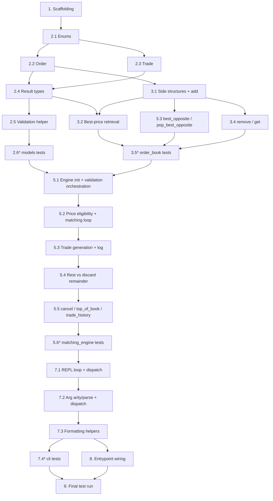

# Implementation Plan: Limit Order Book & Matching Engine

## Overview

This plan converts the approved design into a series of incremental, dependency-ordered Python coding tasks. Each task builds on the previous ones and ends with everything wired together into a runnable CLI application with a passing pytest suite.

The module layout is fixed and flat: `models.py`, `order_book.py`, `matching_engine.py`, `cli.py`, and a `tests/` package. Prices are `decimal.Decimal`; quantities are positive integers; order IDs and trade IDs are monotonically increasing integers starting at 1. The runtime uses the Python standard library only; `pytest` is the sole development dependency. Testing is deterministic pytest unit tests only — no property-based testing.

## Tasks

- [x] 1. Set up project scaffolding and test harness
  - Create the package directory layout: source modules alongside a `tests/` package containing an `__init__.py`
  - Create empty `models.py`, `order_book.py`, `matching_engine.py`, and `cli.py` module files as the flat, fixed structure (no `orders.py`, `trades.py`, or `results.py`)
  - Add a `requirements-dev.txt` (or equivalent dev-dependency declaration) listing `pytest` as the sole development dependency; confirm no runtime dependencies beyond the standard library
  - Add a minimal `pytest` configuration (e.g. `pytest.ini` / `pyproject.toml` `[tool.pytest.ini_options]`) pointing at the `tests/` directory
  - _Requirements: 8.9_

- [ ] 2. Implement domain and result types in `models.py`
  - [ ] 2.1 Implement the `Side` and `OrderType` enums
    - Define `Side` with values exactly `"Buy"` and `"Sell"`, and `OrderType` with `"Limit"` and `"Market"`
    - _Requirements: 1.4_

  - [ ] 2.2 Implement the `Order` dataclass
    - Fields: `order_id`, `side`, `order_type`, `quantity`, `remaining_quantity`, `price` (`Decimal | None`, `None` for market orders); no `sequence` field
    - `remaining_quantity` starts equal to `quantity`
    - _Requirements: 1.1, 1.2, 3.7_

  - [ ] 2.3 Implement the `Trade` dataclass
    - Frozen dataclass with `trade_id`, `price` (`Decimal`), `quantity`, `aggressor_order_id`, `resting_order_id`, `aggressor_side`, and `timestamp` (UTC)
    - _Requirements: 5.1, 5.2_

  - [ ] 2.4 Implement the result/response value types
    - Define `Fill`, `SubmissionResult`, `CancellationResult`, `BookLevel`, `TopOfBook`, and `ValidationError` as described in the design (frozen dataclasses)
    - _Requirements: 1.1, 1.2, 2.6, 2.7, 4.1, 4.5, 6.1, 6.2, 6.3, 6.4_

  - [ ] 2.5 Implement the submission validation helper(s)
    - Add `validate_submission(...)` (and any small helpers) returning either normalized fields or a `ValidationError`: reject quantity `<= 0`/non-integer, side not exactly Buy/Sell, limit price `<= 0`, missing/null required fields (naming the field), and market orders carrying a price
    - Use error codes such as `INVALID_QUANTITY`, `INVALID_SIDE`, `INVALID_PRICE`, `MISSING_FIELD`
    - _Requirements: 1.3, 1.4, 1.5, 1.7, 2.2, 2.3, 2.5_

  - [ ]* 2.6 Write unit tests for `models.py` (`tests/test_models.py`)
    - Test enum values, `Order`/`Trade`/result-type construction, and every validation branch (invalid quantity, invalid side, invalid/missing price, missing required fields, market-with-price)
    - _Requirements: 1.3, 1.4, 1.5, 1.7, 2.2, 2.3, 2.5_

- [ ] 3. Implement the resting-order storage in `order_book.py`
  - [ ] 3.1 Implement the per-side structures and `add`
    - For each side maintain `levels: dict[Decimal, deque[Order]]`, a `heapq` price index (buy side stores negated prices), and a `by_id: dict[int, Order]`
    - `add(order)` appends to the level deque and updates `by_id`; push onto the heap ONLY when the price level is newly created
    - _Requirements: 3.3_

  - [ ] 3.2 Implement best-price retrieval with lazy heap deletion
    - `best_bid_level()` / `best_ask_level()` return a `BookLevel` with the best price and aggregate `remaining_quantity` summed across that level's deque; discard stale heap entries whose level is empty/missing; return `BookLevel(price=None, aggregate_quantity=0)` when the side is empty
    - _Requirements: 6.1, 6.2, 6.3, 6.4, 6.5, 6.6_

  - [ ] 3.3 Implement `best_opposite` and `pop_best_opposite`
    - `best_opposite(incoming_side)` peeks the best-price, earliest-arrival resting order on the opposite side (no removal)
    - `pop_best_opposite(incoming_side)` removes and returns the front order via `deque.popleft()` (O(1)), deletes it from `by_id`, and drops the level when its deque empties — used for full-fill removal only
    - _Requirements: 3.1, 3.2, 3.9, 3.10, 3.11_

  - [ ] 3.4 Implement `remove(order_id)` and `get(order_id)`
    - `remove(order_id)` locates a resting order by id, scans its price-level deque to remove it (O(k)), and deletes it from `by_id` — cancellation path only, never full-fill
    - `get(order_id)` returns the resting order or `None`
    - _Requirements: 4.1, 4.4, 4.5_

  - [ ]* 3.5 Write unit tests for `order_book.py` (`tests/test_order_book.py`)
    - Test add into new vs existing price levels (heap-push discipline), best bid/ask with aggregate quantity, empty-side `BookLevel`, `best_opposite` peek vs `pop_best_opposite` removal and level drop, and `remove`/`get` by id including partially-filled remainder removal
    - _Requirements: 3.1, 3.2, 3.3, 4.1, 4.4, 4.5, 6.1, 6.2, 6.3, 6.4, 6.5, 6.6_

- [ ] 4. Checkpoint - Ensure all tests pass
  - Ensure all tests pass, ask the user if questions arise.

- [ ] 5. Implement the matching engine in `matching_engine.py`
  - [ ] 5.1 Implement engine construction, ID assignment, and validation orchestration
    - Own `OrderBook`, trade log, `_next_order_id` and `_next_trade_id` (both starting at 1); run `validate_submission` first and, on failure, return `SubmissionResult(accepted=False, error=...)` leaving the book unchanged; assign IDs only to accepted orders
    - _Requirements: 1.1, 1.2, 1.3, 1.4, 1.5, 1.6, 1.7, 2.2, 2.3, 2.5_

  - [ ] 5.2 Implement price eligibility and the matching loop
    - Loop while `remaining_quantity > 0`: peek `best_opposite`; stop if none or not price-eligible (buy limit `L >= P`, sell limit `L <= P`, market always eligible); compute `matched_qty = min(...)`, `exec_price = resting.price`; decrement both remainders; full-fill via `pop_best_opposite`; partial fill leaves the resting order at the front of its level
    - _Requirements: 2.4, 3.1, 3.2, 3.3, 3.6, 3.7, 3.8, 3.9, 3.10, 3.11, 3.12_

  - [ ] 5.3 Implement trade generation and the trade log
    - For each match create a `Trade` with a fresh monotonic `trade_id`, resting execution price, matched quantity, both order IDs, aggressor side, and UTC timestamp; append to the log in occurrence order and add a `Fill` to the result
    - _Requirements: 5.1, 5.2, 5.3, 5.4_

  - [ ] 5.4 Implement rest-remainder vs discard-remainder after the loop
    - Limit order with `remaining_quantity > 0`: add remainder to the book at its limit price and report `resting_quantity`; market order with `remaining_quantity > 0`: discard remainder, do not add to book, report `discarded_quantity`
    - _Requirements: 2.6, 2.7, 3.4, 3.5_

  - [ ] 5.5 Implement `cancel`, `top_of_book`, and `trade_history`
    - `cancel(order_id)`: reject invalid identifier (`INVALID_ID`) and not-found (`ORDER_NOT_FOUND`) leaving the book unchanged; on success remove via `remove(order_id)` and return `removed_quantity`
    - `top_of_book()` builds a `TopOfBook` from best bid/ask levels; `trade_history()` returns recorded trades in ascending order (empty list when none)
    - _Requirements: 4.1, 4.2, 4.3, 4.5, 5.5, 5.6, 6.1, 6.2, 6.3, 6.4, 6.5, 6.6_

  - [ ]* 5.6 Write unit tests for `matching_engine.py` (`tests/test_matching_engine.py`)
    - `test_crossing_limits_single_trade`: crossing buy/sell limits produce exactly one trade at the resting price with qty = min of the two — _Requirements: 8.1, 3.6, 3.7_
    - `test_time_priority_within_level`: same-level FIFO — resting_order_ids appear in ascending arrival order — _Requirements: 8.2, 3.3_
    - `test_sweep_multiple_resting`: aggressor sweeps multiple resting orders; trade count == resting orders consumed — _Requirements: 8.3, 3.9, 3.11_
    - `test_partial_fill_rests_remainder`: partially filled incoming limit rests remainder = submitted − matched — _Requirements: 8.4, 2.7, 3.8_
    - `test_market_fills_then_discards`: market fills against best available then discards remainder, not added to book — _Requirements: 8.5, 2.4, 2.6_
    - `test_cancel_prevents_match`: cancelled resting order yields no trade against a later crossing aggressor — _Requirements: 8.6, 4.4_
    - `test_top_of_book_aggregate`: best bid/ask price and summed remaining quantity at each level — _Requirements: 8.7, 6.1, 6.2, 6.5_
    - `test_non_crossing_limit_rests`: buy limit below best ask yields zero trades and rests in the book — _Requirements: 8.8, 3.4_
    - Also cover validation rejections, ID monotonicity, and trade-history ordering/empty cases; assert only against observable outputs — _Requirements: 1.6, 5.4, 5.5, 5.6, 8.9_

- [ ] 6. Checkpoint - Ensure all tests pass
  - Ensure all tests pass, ask the user if questions arise.

- [ ] 7. Implement the CLI in `cli.py`
  - [ ] 7.1 Implement the REPL loop and command dispatch
    - `run(engine, input_fn=input, output_fn=print)` reads a line, splits with `str.split()`, dispatches on the keyword (`limit`, `market`, `cancel`, `book`, `trades`, `help`, `exit`/`quit`); unrecognized keyword prints an error plus the supported-command list; `exit`/`quit` terminates
    - _Requirements: 7.6, 7.8_

  - [ ] 7.2 Implement argument arity/parse checks and engine dispatch
    - Each handler checks argument count and parses/normalizes types (side text → `Side` case-insensitively, quantity → `int`, price → `Decimal`) before calling the engine; on wrong count or unparseable argument print that command's usage message and do NOT call the engine
    - _Requirements: 7.7_

  - [ ] 7.3 Implement result and error formatting helpers
    - Pure helpers (e.g. `format_submission`, `format_top_of_book`) format: accepted limit order id; per-fill trade lines plus discarded-quantity note; cancel success and not-found messages; top-of-book with per-side unavailable indicator; trade list and empty indicator; and validation-rejection messages with no order id shown
    - _Requirements: 7.1, 7.2, 7.3, 7.4, 7.5, 7.9, 7.10_

  - [ ]* 7.4 Write unit tests for `cli.py` (`tests/test_cli.py`)
    - Drive the REPL via injected `input_fn`/`output_fn` and assert on captured output: limit/market/cancel/book/trades/help/exit flows, unknown command, malformed/missing arguments (engine not called), and validation-rejection surfacing
    - _Requirements: 7.1, 7.2, 7.3, 7.4, 7.5, 7.6, 7.7, 7.8, 7.9, 7.10_

- [ ] 8. Wire up the application entrypoint
  - Add a `__main__` entrypoint (e.g. `if __name__ == "__main__":` in `cli.py` or a small `main()`) that constructs a `MatchingEngine` and calls `run(engine)` so the REPL is launchable, with no orphaned modules
  - _Requirements: 7.1, 7.8_

- [ ] 9. Final checkpoint - Run the full test suite
  - Run the complete pytest suite (single run, not watch mode) and ensure all tests pass; ask the user if questions arise.

## Notes

- Tasks marked with `*` are optional test sub-tasks and can be skipped for a faster MVP; core implementation tasks are never optional.
- Each task references the specific requirements it implements for traceability.
- Testing is deterministic pytest unit tests only — no property-based testing, no Hypothesis, no `test_properties.py`.
- All test assertions target observable engine outputs (recorded trades, resting orders, reported top of book), never private internals (Req 8.9).
- The module layout is fixed: `models.py`, `order_book.py`, `matching_engine.py`, `cli.py`, `tests/`. No `orders.py`, `trades.py`, or `results.py`.

## Task Dependency Graph



```json
{
  "waves": [
    { "id": 0, "tasks": ["2.1"] },
    { "id": 1, "tasks": ["2.2", "2.3"] },
    { "id": 2, "tasks": ["2.4"] },
    { "id": 3, "tasks": ["2.5", "3.1"] },
    { "id": 4, "tasks": ["2.6", "3.2", "3.3", "3.4"] },
    { "id": 5, "tasks": ["3.5"] },
    { "id": 6, "tasks": ["5.1"] },
    { "id": 7, "tasks": ["5.2"] },
    { "id": 8, "tasks": ["5.3"] },
    { "id": 9, "tasks": ["5.4"] },
    { "id": 10, "tasks": ["5.5"] },
    { "id": 11, "tasks": ["5.6"] },
    { "id": 12, "tasks": ["7.1"] },
    { "id": 13, "tasks": ["7.2"] },
    { "id": 14, "tasks": ["7.3"] },
    { "id": 15, "tasks": ["7.4"] }
  ]
}
```
